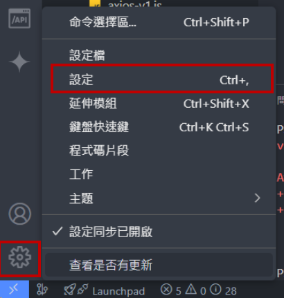
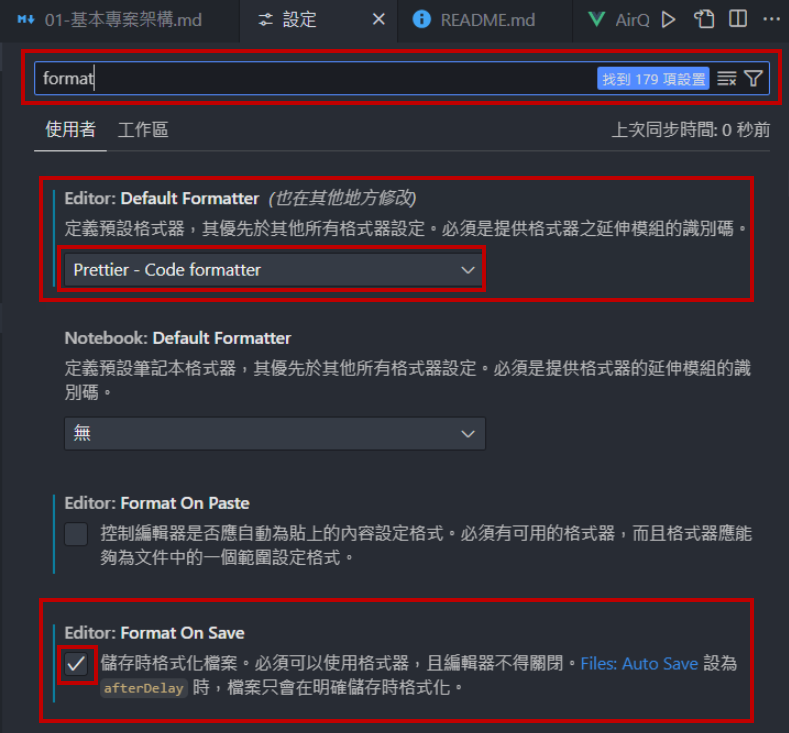

# 基本專案架構

## 專案基本建置、基本格式和工具

- 建議用`nvm`安裝node

1. 目前此使用的 node 版本為 20.12.2。可先看看專案能否順利建置，終端機輸入
   (1) `npm install`
   (2) `npm run dev`
2. 確認 prettier 是否有運作、儲存的時候是否有自動排版、自動修正 eslint 錯誤
   - 如果 prettier 沒有正常運作的話，先在 vscode [擴充工具](https://marketplace.visualstudio.com/items?itemName=esbenp.prettier-vscode)加入 prettier
   - 在 vscode 左下角的齒輪選擇設定
     
   - 在上方的搜尋輸入 format ，將 Default Formatter 改為 Prettier、將 Editor:Format On Save 打勾
     
3. 目前檔案名稱會使用大駝峰方式命名 (像是 `AirInfo.vue`)、檔案內的變數則使用小駝峰 (像是 `const positionSearch = ref('')` )、store名稱會用`use`開頭，`store`結尾 (像是 `useDocSummaryStore.js`)、composable及utils會使用`use`開頭 (像是 `useAlert.js`)。
4. 每個頁面裡面，JS 部分要加上 `<script setup>` 標籤

   ```html
   <script setup>
     // JS 部分，要記得加 setup
   </script>

   <template>
     <div>// 暫時先維持 template 單一節點</div>
   </template>

   <style scoped>
     // 若是只對這一個元件的樣式，可放在這邊，style 要加上 scoped
   </style>
   ```

5. 目前專案有分Meeting (排會)、User (使用者)
6. 方法、參數或是Props最好都加註解
7. 如果有寫component或composables，請寫說明文件在documents資料夾內，並新增對應的資料夾及檔案名稱
8. 呼叫 API 和 alert 有共用方法 (像 useAxios 和 useAlert)，等有 API 之後共用的呼叫 API 方法會再微調 (主要針對後端來的 API 進行調整)。使用方式可參考文件 src/documents/composables
9. 假資料格式設計 (json) 請寫在public/jsonExampleData 內，資料夾及檔案名稱請使用小駝峰 (像是 `attachmentFive.json`)

### Devtool

1. 可以使用 devtool 工具看一些相關變數、store 那邊資料跟元件
   - 不確定畫面上的部件是在哪一個元件內的時候，也可以用 devtool 查看

### 建置專案時可能出現的錯誤

1. `npm install` 的時候出現錯誤 `因為這個系統上已停用指令碼執行，所以無法載入...`
   - 在終端機輸入 `Get-ExecutionPolicy` 看看是不是出現 `Restricted`，如果是的話，表示被 windows 安全性政策去禁止執行一些不安全的指令
   - 使用管理員身分執行 powerShell，輸入指令 `Set-ExecutionPolicy RemoteSigned` ，這個指令表示可以使用本機所下的指令，但從遠端下載要執行的指令要經過同意才可以
   - 詳細可參考此篇[文章](https://israynotarray.com/other/20200510/1067127387/)

### 環境變數

1. `.env.development` 本機設定檔 (本機預設run --port 5174)
2. `.env.production` 正式機設定檔
3. `.env.production-test` 測式機設定檔

### Git Commit 命名規範與推送說明

1. 因為此專案為環評外網，因此推git 需在 commit message 最後空一格並加上 EnvProtection/EiaWeb2g#issue編號 (像是 :
   feat (FE_public): 加上 loading、調整 nav 連結 EnvProtection/EiaWeb2g#14)

2. 類型 type 說明

- feat: 新增/修改功能 (feature)。
- fix: 修補 bug (bug fix)。
- docs: 文件 (documentation)。
- style: 格式 (不影響程式碼運行的變動 white-space, formatting, missing semi colons, etc)。
- refactor: 重構 (既不是新增功能，也不是修補 bug 的程式碼變動)。
- perf: 改善效能 (A code change that improves performance)。
- test: 增加測試 (when adding missing tests)。
- chore: 建構程序或輔助工具的變動 (maintain)。
- revert: 撤銷回覆先前的 commit 例如：revert: type(scope): subject (回覆版本：xxxx)。

3. 提交前請檢查並移除

- console.log
- 無用變數與註解
- 測試用資料與語句

4. 前端會在類型後方寫上 `(FE_某功能模組)`(像是 `(FE_login)`，代表前端的登入功能或模組)

### CSS 設定相關

1. Tailwind 共用檔案在`main.css`可增加相關共用CSS，若只有區塊使用，請寫在`<style scoped>`內，若需要自訂樣式，可先參考`main.css`是否已有寫相關樣式 (例如表單、按鈕、link)
2. 大致顏色及樣式請參照其他頁面，風格一致，顏色設定皆以 [Tailwind colors](https://tailwindcss.com/docs/colors)內的顏色為主
3. icon 以 Tailwind 所開發的開源圖示套件為主 [heroicons](https://heroicons.com/)
